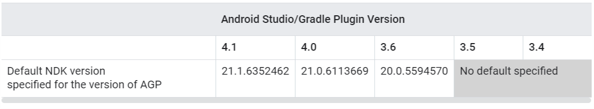
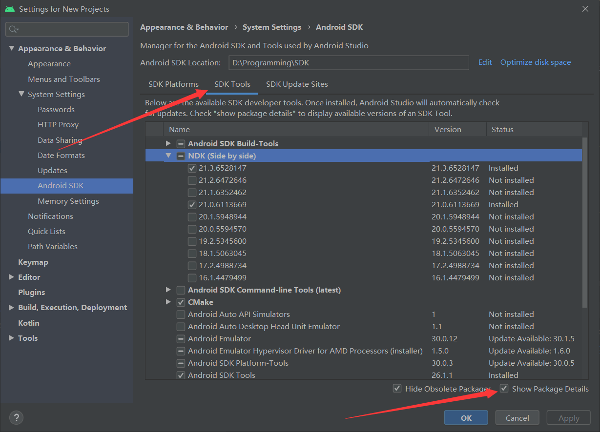
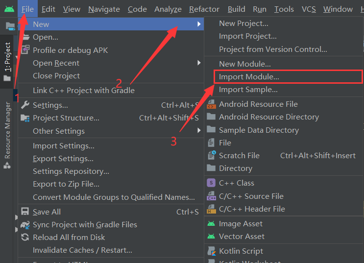
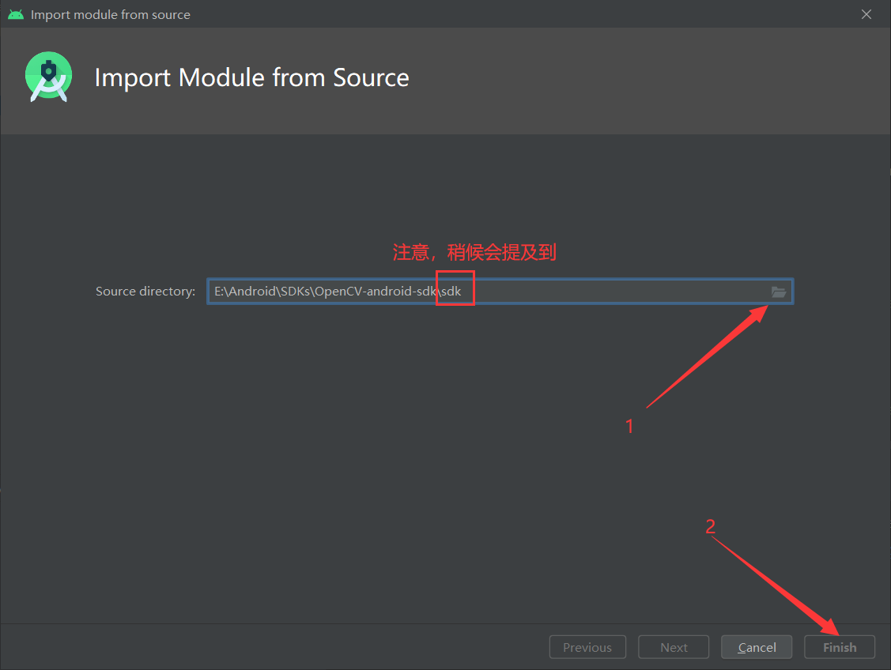
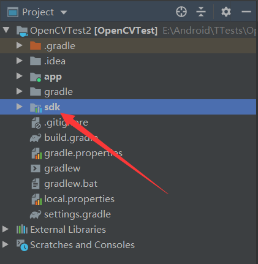
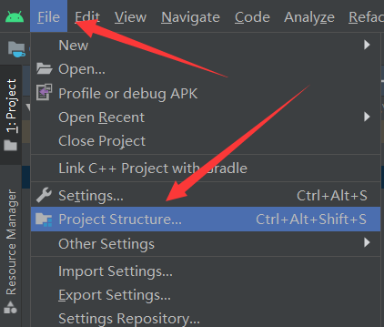
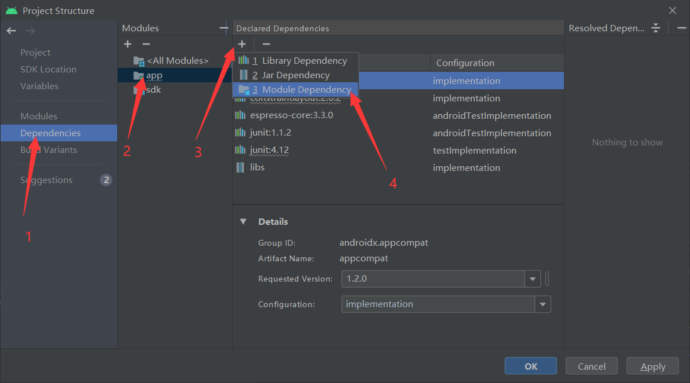
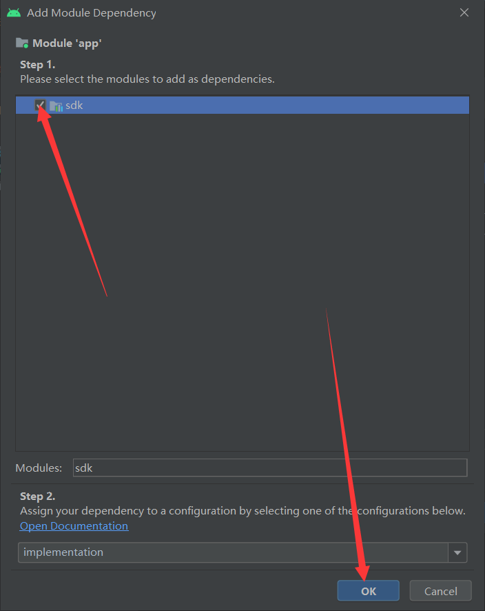

# 使用 Android Studio 4.0 引入 OpenCV 

1. 下载与 `Android Studio` 版本对应的 **`NDK`**，如图





2. 下载 [OpenCV](https://opencv.org/releases/) 开发包

3. 创建一个普通的 **`Android `**工程

4. 导入 **`OpenCV`**

   - 选择 **`File -> New -> Import Module`**

   

   

   

   - 选择刚刚下载的 **`OpenCV `**的开发包的路径

   

   

   

   - 导入成功后在项目目录下会新增一个 刚刚导入的文件夹名字的依赖（上图中标注的 **`sdk`**）

   

   

   

   - 配置项目结构 **`File -> Project Structure`**

   

   

   

   

   

   - 添加 **`sdk `**依赖

   

   

   

   - 导入完成

5. 测试

```java
package com.test.opencvtest;

import androidx.appcompat.app.AppCompatActivity;

import android.os.Bundle;
import android.widget.Toast;

import org.opencv.android.BaseLoaderCallback;
import org.opencv.android.LoaderCallbackInterface;
import org.opencv.android.OpenCVLoader;

public class MainActivity extends AppCompatActivity {

    private LoaderCallbackInterface mLoaderCallback = new BaseLoaderCallback(this) {
        @Override
        public void onManagerConnected(int status) {
            super.onManagerConnected(status);
            if (status == BaseLoaderCallback.SUCCESS) {
                Toast.makeText(MainActivity.this, "OpenCV 加载成功", Toast.LENGTH_SHORT).show();
            } else {
                Toast.makeText(MainActivity.this, "OpenCV 加载失败", Toast.LENGTH_SHORT).show();
            }
        }
    };

    @Override
    protected void onCreate(Bundle savedInstanceState) {
        super.onCreate(savedInstanceState);
        setContentView(R.layout.activity_main);
    }

    @Override
    protected void onResume() {
        super.onResume();
        if (!OpenCVLoader.initDebug())
            OpenCVLoader.initAsync(OpenCVLoader.OPENCV_VERSION_3_4_0, this, mLoaderCallback);
        else
            mLoaderCallback.onManagerConnected(LoaderCallbackInterface.SUCCESS);
    }
}
```

