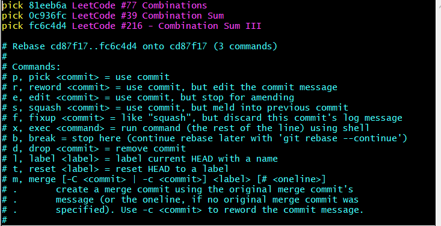
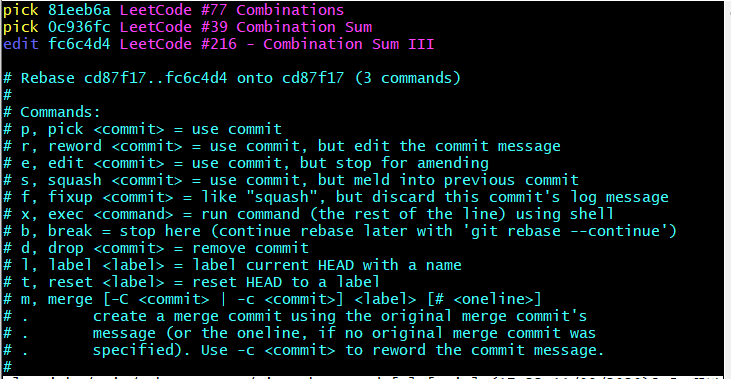
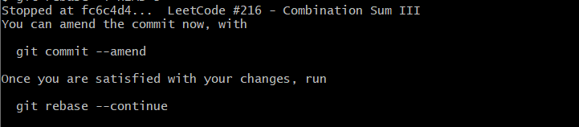

# Git 如何修改之前 commit 的信息

1. **`git rebase -i HEAD~3`** 找到最近 **`3`** 次的提交

   

2. 找到你要修改的项，将前面的 **`pick`** 修改为 **`edit`** 后直接 **`:wq`** 保存退出，其他的不要动

   

3. 保存退出后会提示如下信息

   

4. 照提示输入 **`git commit --amend`** 后，会进入到修改界面，修改提交信息后，**`:wq`** 保存退出

   

5. 继续输入 **`git rebase --continue`** 

   

6. 最后输入 **`git push -f`** 强制提交，*有可能需要指定远程分支*

   

