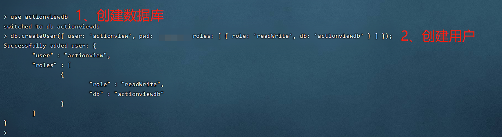

# 使用 docker-compose 搭建 ActionView(CentOS&Nginx版本)

## 1、确定使用到的环境

根据官方安装指引，需要用到：

1. Git
2. Nginx
3. php
4. mongodb

除 Git 外，其余使用 docker-compose 搭建，如何安装 docker-compose 请查看 [这里](https://cloud.tencent.com/developer/article/1855291)

## 2、编写 docker-compose.yml

docker-compose.yml 参考如下配置：

```yml
version: '3.6'
services:
  nginx:
    restart: always
    image: daocloud.io/library/nginx:1.9.1
    container_name: nginx
    ports:
      - 80:80
      - 443:443
      - 8080-8081:8080-8081
    depends_on:
      - php
      - mysql
    links:
      - php:php
      - mysql:mysql
    volumes:
      - ./logs/nginx:/var/log/nginx
      - ./nginx/conf.d:/etc/nginx/conf.d
      - ./nginx/modules:/etc/nginx/modules
      - ./nginx/vhosts:/etc/nginx/vhosts
      - ./nginx/nginx.conf:/etc/nginx/nginx.conf
      - /home/www:/home/www
    networks:
      - netnp

  mongodb:
    image: mongo:4.1.6
    container_name: mongodb
    ports:
      - 27017:27017
    volumes:
      - ./mongodb/data:/data/db
      - ./mongodb/configdb:/data/configdb
    environment:
      - MONGO_INITDB_ROOT_USERNAME=adminmongo
      - MONGO_INITDB_ROOT_PASSWORD=adminmongo

  mongo-express:
    image: mongo-express
    container_name: mongo-express
    ports:
      - 27018:8081
    depends_on:
      - mongodb
    environment:
      - ME_CONFIG_MONGODB_ADMINUSERNAME=adminmongo
      - ME_CONFIG_MONGODB_ADMINPASSWORD=adminmongo
      - ME_CONFIG_MONGODB_SERVER=mongodb

  php:
    restart: always
    image: daocloud.io/library/php:7.3.19-fpm
    container_name: php
    ports:
      - 9000:9000
    volumes:
      - /home/www:/home/www
      - ./php/php.ini:/usr/local/etc/php/php.ini
      - ./php/ext/install-php-extensions:/usr/local/bin/install-php-extensions
      - ./php/lib:/usr/local/lib/php/extensions/no-debug-non-zts-20180731
    environment:
      RUN_ENV: local
    networks:
      - netnp

networks:
    netnp:

```

## 2、下载 ActionView 程序

1. 进入 **php** 放置网站的目录，如 `cd /home/www`
2. 使用 git 拉取：`git clone https://gitee.com/actionview/av.git actionview`

## 3、初始化数据

1. 使用 `docker exec -it <mongodb 镜像名：如 mongodb> bash` 进入容器内部
2. 使用 `mongo -u <用户名> -p <密码>` 进入 mongo 控制台
3. 使用 `use actionviewdb` 创建数据库
4. 使用 `db.createUser({ user: 'actionview', pwd: '<密码>', roles: [ { role: 'readWrite', db: 'actionviewdb' } ] });` 创建用户



5. 初始化 mongodb 数据

   1. `cd actionview`，将 dbdata 目录复制到 mongodb 映射的数据卷中【重要】
   2. 进入 mongodb 容器内部
   3. `mongorestore -h 127.0.0.1 -u actionview -p <mongodb用户名密码> -d actionviewdb --drop ./dbdata`

   

## 4、启动 ActionView 程序

1. 进入 **php** 容器内部

2. `cd actionview`

3. `cp composer.phar /usr/local/bin/composer `

4. `composer install --no-dev` ：这一步可能会出现某些扩展找不到的问题，则需要在 `php.ini` 启用对应的扩展（使用 `php --ini` 查找配置文件路径），有的扩展如 `zip、mongodb` 在原扩展目录中并没有，则需要自行安装：使用 [GitHub - mlocati/docker-php-extension-installer: Easily install PHP extension in Docker containers](https://github.com/mlocati/docker-php-extension-installer) 提供的工具方便安装扩展

   下载最新版，然后使用 `docker cp install-php-extensions php:/usr/local/bin/install-php-extensions`，并使用 `chomd +x usr/local/bin/install-php-extensions` 添加执行权限

   **默认源可能会比较慢，修改为国内源安装扩展会比较快，如 https://developer.aliyun.com/mirror/，使用 `cat /etc/debian_version 查看对应版本，然后去网站找对应的 sources.list 并替换**

   - gd：`install-php-extensions gd` （以下是普通安装方式）

     1. 修改 apt 源：

        ```sh
        # 依次执行：
        
        echo "deb http://mirrors.163.com/debian/ stretch main non-free contrib" >/etc/apt/sources.list
        
        echo "deb http://mirrors.163.com/debian/ stretch-proposed-updates main non-free contrib" >>/etc/apt/sources.list
        
        echo "deb-src http://mirrors.163.com/debian/ stretch main non-free contrib" >>/etc/apt/sources.list
        
        echo "deb-src http://mirrors.163.com/debian/ stretch-proposed-updates main non-free contrib" >>/etc/apt/sources.list
        ```

        

     2. 安装 gd 扩展

        ```sh
        # 更新软件源
        apt update
        # 安装各种库
        apt install -y libwebp-dev libjpeg-dev libpng-dev libfreetype6-dev
        # 解压源码
        docker-php-source extract
        # 进入gd源码文件夹
        cd /usr/src/php/ext/gd
        # 准备编译
        docker-php-ext-configure gd --with-webp-dir=/usr/include/webp --with-jpeg-dir=/usr/include --with-png-dir=/usr/include --with-freetype-dir=/usr/include/freetype2
        # 编译安装 
        docker-php-ext-install gd
        # 检查扩展是否安装成功
        php -m | grep gd
        ```

        

   - zip：`install-php-extensions zip`(以下是普通安装方式)

     1. 安装 libzip 依赖：`apt-get update && apt-get install -y zlib1g-dev && apt-get install -y libzip-dev`
     2. 使用 `pecl install zip` 完成 zip 扩展安装

   - ssl：`apt-get install -y libcurl4-openssl-dev pkg-config libssl-dev` 

   - mongodb：使用 `pecl install mongodb`  安装扩展，使用 `docker-php-ext-enable mongodb` 启用扩展（ssl 扩展要在 mongodb 前安装，若先安装了 mongodb，则使用 `pecl uninstall mongodb` 后重新安装）

   - ldap：`install-php-extensions ldap`

5. 重启 **php** 容器：`sudo docker restart php`

6. 执行配置脚本：`sh config.sh`

7. 修改数据库连接参数：`cp .env.example .env`，回到宿主机中修改 .env 文件

   ```sh
   DB_HOST=mongodb
   DB_DATABASE=actionviewdb
   DB_USERNAME=actionview
   DB_PASSWORD=创建用户时指定的密码
   ```

   

## 4、启动测试

1. 配置 Nginx

   ```nginx
   server {
       listen 80;
       listen [::]:80;
   	
       # actionview 的目录
       root /home/www/top/web/actionview/public;
   
       # 域名
       server_name nesanero.top;
   
       client_max_body_size 100M;
   
       location ^~ /actionview/api {
           index index.html index.htm index.php;
           try_files $uri $uri/ /index.php$is_args$args;
       }
   
       location ^~ /actionview {
           add_header Cache-Control 'no-cache, must-revalidate, max-age=0';
           alias /home/www/top/web/actionview/public/;
           index index.html index.htm index.php;
           try_files $uri $uri/ /index.html$is_args$args;
       }
   
       location / {
          add_header Cache-Control 'no-cache, must-revalidate, max-age=0';
          index index.html index.htm index.php;
       }
   
       location ~ /\.ht {
           deny all;
       }
   
       location ~ \.php {
           fastcgi_pass   php:9000;
           fastcgi_index  index.php;
           include        fastcgi_params;
           fastcgi_split_path_info ^(.+\.php)(/.+)$;
           fastcgi_param SCRIPT_FILENAME $document_root$fastcgi_script_name;
           fastcgi_param SCRIPT_NAME $fastcgi_script_name;
           try_files $uri =404;
       }
   }
   ```

   

2. 重启 Nginx 和 php `docker restart nginx && docker restart php`

3. 配置 crontab，以便能发mail通知、为燃尽图展示提供数据、自动同步LDAP用户数据。

   ```
   vim /etc/crontab
   
   # 添加如下语句【路径需要注意一下】
   * * * * * root /usr/bin/docker exec php /usr/local/bin/php /home/www/top/web/actionview/artisan schedule:run >> /home/www/top/web/actionview/logs/crons.log
   
   # esc :wq 保存后 
   systemctl restart crond 
   ```

   

4. 访问 域名/actionview，登录：user: [admin@action.view](mailto:admin@action.view), password: actionview

## 5、 注意事项

1. docker  重启 php 后，需要使用 `docker-php-ext-install xxx` 重新安装需要的扩展

